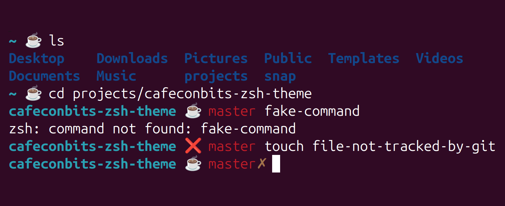

# ZSH theme "Cafe con Bits"

Welcome to my personal **ZSH theme "Cafe con Bits"**: it's simple, clear and has a coffee cup ☕.



Inspired by `robbyrussell` theme.

## How to install

It works on **Oh My Bash**: https://ohmyz.sh/

If you didn't installed, go to that web and install it before continue.

Once it is installed, you can find all the themes in `~/.oh-my-zsh/themes/`.

First, copy de file `cafeconbits.zsh-theme` to that path. Open the terminal and go to this project's directory:

```
$ cp cafeconbits.zsh-theme ~/.oh-my-zsh/themes/
```

Second and last, open the `~/.zshrc` configuration file, and change the variable `ZSH_THEME`:

```
# ZSH_THEME="robbyrussell"
ZSH_THEME="cafeconbits"
```

Now, open a new terminal and enjoy it! ☕